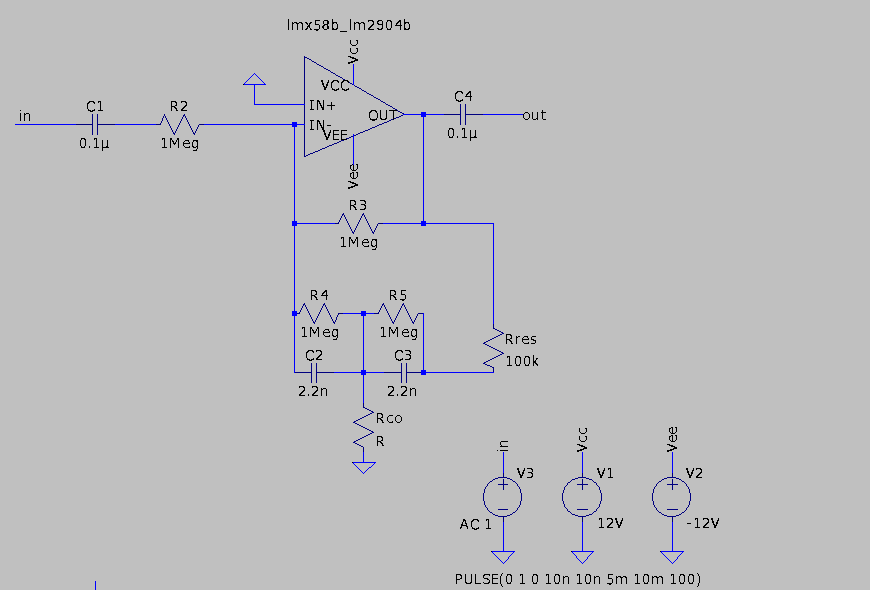
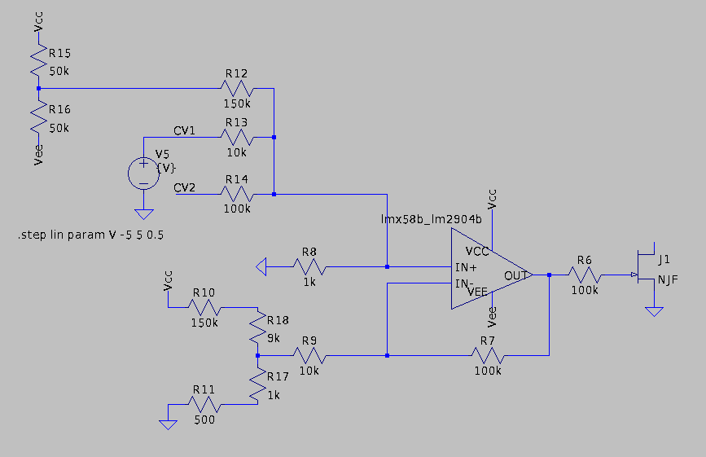

# Voltage Controlled Filter 
Hier eine kurze Doku zu meinem VCF. Dieses Markdown wird laufend aktualisiert.
Die Schaltung ist von Ray Wilson und auf der Website [MFOS] (http://musicfromouterspace.com/index.php?MAINTAB=SYNTHDIY&VPW=1344&VPH=561)
zu finden.

- [Anforderungen](#anforderungen)
- [Tiefpass](#tiefpass)
- [Hochpass](#hochpass)
- [CV](#cv)
- [Bauteile](#bauteile)
	<!--- - [Thema 3](#thema3)	-->

# Anforderungen
Folgende Annamen wurden getroffen:
- Eingangs CV Vpp =~ 10V

| Parameter            | Wert                   |
| -------------------- | ---------------------- |
| `Gain` | `1 (0dB)` |
| `Cut-Off Frequenz ` | `100Hz - 10kHz` |
| `Resonanz (Q-Faktor)` | `TBD` |

# Tiefpass

Es handelt sich um einen Aktiven Tiefpass 2. Ordnung mit einem Gain von 1.
Die Cut-Off Frequenz kann über den Rco eingestellt werden, indem er die Brücke aus den Kondensatoren C2 und C3 
näher bzw. weiter nach Ground zieht. Dieser wird später durch einen VCR (Voltage Controlled Resistor) ersetzt.
C1 wird für das Blocken von DC-Anteilen des Eingangssignals eingesetzt.
# Hochpass
# CV

Hier handelt es sich um eine Schaltung für einen VCR (Voltage Controlled Resistor).
Dabei wird ein NJFET im ohmschen-Bereich betrieben.
Der 100k-Spannungsteiler aus R15 und R16 determinieren die Spannung VGS des NJFETs. 
Um den Spannungsbereich zu dieses Spannungsteilers einzustellen, wird ein weiterer Spannungsteiler aus R18 und R17 eingesetzt.
Zusammen mit R7 und R9, die den Verstärkunsfaktor des OPVs bestimmen, kann der Spannungsbereich von VGS eingestellt werden.
Diese Werte müssen auf den spezifisch verwendeten JFET abgestimmt werden.

# Bauteile
| Bauteil            | Wert                   |
| -------------------- | ---------------------- |
| `20x R` | `100 - 1MOhm` |
| `10x C` | `2.2nF - 1uF` |
| `4x OPV` | `LM358` |
| `1x NJFET` | `PN4391 NFET` |
| `4x Poti` | `100k` |
| `4x Klinke` | `3.5mm` |

